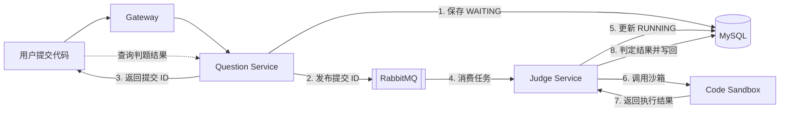
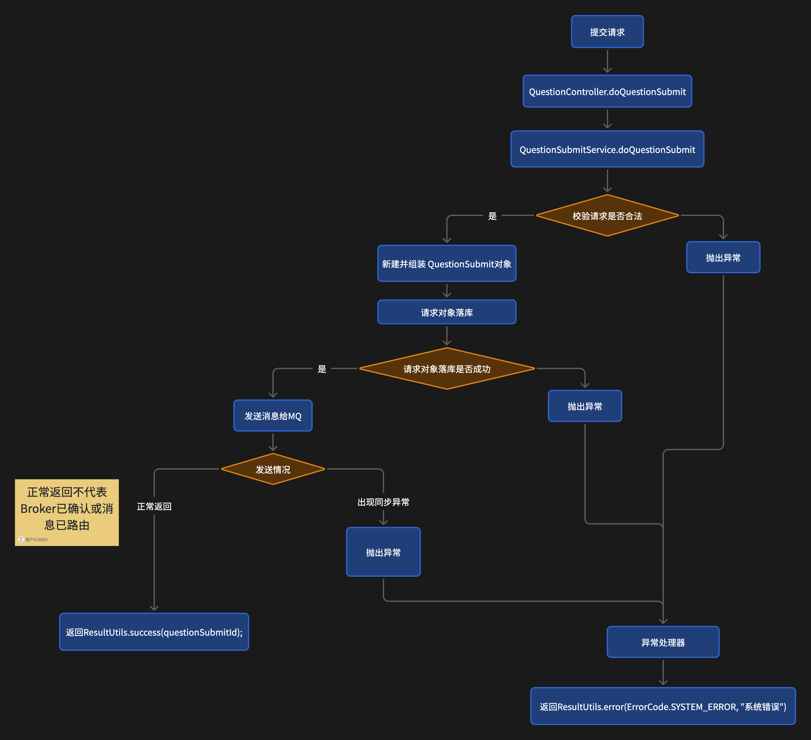
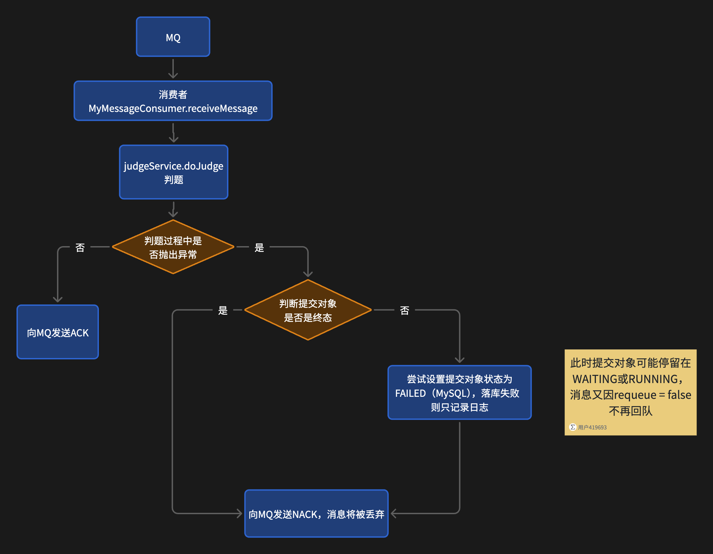
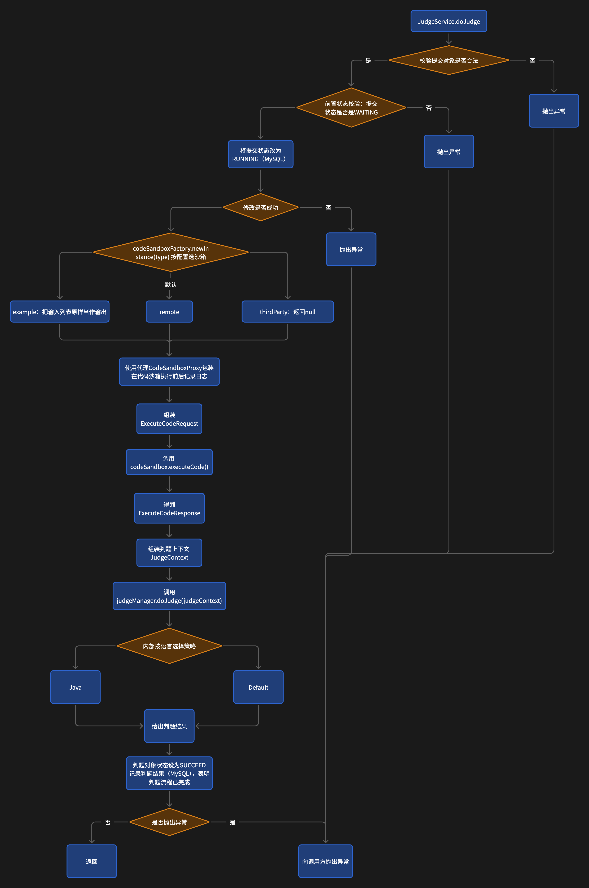

# CodeOJ：基于 Spring Cloud 的在线判题系统

CodeOJ 是我基于 **Spring Cloud + Vue 3** 实现的微服务在线判题系统，覆盖用户与题目管理、代码提交、RabbitMQ 异步判题、代码沙箱执行和判题结果查询。

本项目跟随程序员鱼皮的 OJ 在线判题系统实战教程逐步完成编码、配置和调试，并在实现基础上梳理了提交、消息消费与判题执行三条核心源码流程。

## 核心功能

- 用户注册、登录、Spring Session Redis 共享登录态和角色鉴权；
- 题目创建、编辑、查询和提交记录管理；
- Monaco Editor 在线编写并提交代码；
- RabbitMQ 异步传递判题任务；
- 判题服务调用代码沙箱执行程序，并使用判题策略生成结果；
- 查询提交状态、执行信息和 AC、WA 等判题结果。

## 技术栈

| 方向 | 技术 |
|---|---|
| 后端 | Java 8、Spring Boot 2.6.13、Spring Cloud Alibaba、MyBatis-Plus、OpenFeign |
| 数据与消息 | MySQL 8、Redis、Spring Session、RabbitMQ、Nacos |
| 前端 | Vue 3、TypeScript、Vue Router、Vuex、Arco Design、Monaco Editor |
| 工程 | Maven 多模块、Docker Compose、OpenAPI TypeScript Codegen |

## 系统架构

```text
Vue 3
  |
  | /api/**
  v
Gateway :8101
  |-- /api/user/**     -> User Service :8102
  |-- /api/question/** -> Question Service :8103 -> MySQL
  `-- /api/judge/**    -> Judge Service :8104
                                  ^
Question Service -- RabbitMQ -----|
                                  |
                                  `-- HTTP -> Code Sandbox :8090

Redis       Spring Session 共享登录态
Nacos       服务注册与发现
RabbitMQ    判题任务异步传递
MySQL       用户、题目、提交和判题结果
```

## 核心判题链路

用户提交代码后，题目服务先保存提交记录，再将提交 ID 投递到 RabbitMQ。判题服务异步消费任务，将状态更新为 `RUNNING`，调用代码沙箱执行程序，通过判题策略生成结果，最后把流程状态和 `judgeInfo` 写回数据库。



### 1. 提交与任务投递

提交接口完成请求参数、编程语言和题目校验后，以 `WAITING` 状态保存提交记录，再通过 `RabbitTemplate` 将提交 ID 发送到 RabbitMQ。消息发送方法正常返回后，接口向前端返回提交 ID。



> 图中的异常出口为主流程的简化表达：业务异常会保留对应错误码和消息，其他运行时异常由全局异常处理器转换为系统错误。

### 2. MQ 消费与消息确认

消费者收到提交 ID 后调用判题服务。判题正常完成时发送 ACK；出现异常时，消费者检查提交记录是否已经进入终态，必要时尝试将状态写为 `FAILED`，随后发送不重新入队的 NACK。



### 3. 沙箱执行与结果判定

判题服务读取题目和提交信息，校验提交状态后将其更新为 `RUNNING`。服务通过工厂选择代码沙箱，使用代理记录调用日志，再把沙箱输出交给判题策略处理，最终将流程状态更新为 `SUCCEED` 并保存 `judgeInfo`。



`SUCCEED` 表示判题流程已经完成；代码是否通过由 `judgeInfo` 中的 AC、WA 等结果表示。

## 实现要点

### 异步判题

题目服务只负责校验请求、保存提交记录和发布任务，耗时的代码执行由判题服务异步完成。接口可以先返回提交 ID，前端再查询判题状态和结果。

### 状态流转

提交记录以 `WAITING` 状态创建，判题开始后更新为 `RUNNING`，流程结束后写为 `SUCCEED`；消费或判题异常时，消费者尝试写为 `FAILED`。

### 沙箱抽象

`CodeSandboxFactory` 根据配置选择沙箱实现，`CodeSandboxProxy` 统一包装沙箱调用。判题服务通过 `ExecuteCodeRequest` 和 `ExecuteCodeResponse` 与沙箱交互，降低业务编排与执行实现之间的耦合。

### 判题策略

`JudgeManager` 根据提交语言选择判题策略。Java 使用 `JavaLanguageJudgeStrategy`，其他情况进入默认策略，策略根据测试用例、程序输出、时间和内存信息生成 `JudgeInfo`。

## 模块说明

| 模块 | 职责 |
|---|---|
| `codeoj-backend-gateway` | API 路由、CORS 和内部接口请求头校验 |
| `codeoj-backend-user-service` | 注册、登录、用户管理和 Session 读写 |
| `codeoj-backend-question-service` | 题目管理、提交入库、MQ 发布和结果持久化接口 |
| `codeoj-backend-judge-service` | MQ 消费、判题编排、沙箱调用和策略判定 |
| `codeoj-backend-codesandbox` | Java 源码编译和进程执行 |
| `codeoj-backend-service-client` | OpenFeign 内部接口、请求头和权限切面 |
| `codeoj-backend-model` | 跨服务实体、DTO、枚举和沙箱契约 |
| `codeoj-backend-common` | 通用响应、异常、注解和工具 |
| `codeoj-frontend` | Vue 3 页面和 TypeScript API 客户端 |

## 快速启动

### 环境要求

- JDK 8、Maven 3.x；
- MySQL 8、Redis、RabbitMQ、Nacos；
- Docker 与 Docker Compose；
- Node.js 与 npm。

### 后端

先构建 Maven 多模块项目：

```bash
cd codeoj-backend
mvn clean package
```

启动基础设施并完成数据库、RabbitMQ exchange、queue 和 binding 初始化后，再启动各个微服务。仓库中的 Compose 文件可作为本地环境入口：

```bash
docker compose -f docker-compose.env.yml up -d
docker compose -f docker-compose.service.yml up --build
```

RabbitMQ 使用的拓扑为：

```text
exchange: code_exchange
queue:    code_queue
binding:  my_routingKey
```

### 前端

```bash
cd codeoj-frontend
npm ci
npm run serve
```

更完整的环境、配置和验证说明见[部署与运行](docs/learning/02-模块/06-部署与运行.md)。

## 源码学习与面试资料

| 文档 | 内容 |
|---|---|
| [01 总览](docs/learning/01-总览.md) | 项目地图、阅读顺序和完成标准 |
| [02 模块](docs/learning/02-模块/02-公共层与用户服务.md) | 前端、公共层、用户、网关、题目、判题、MQ、沙箱和部署模块 |
| [03 链路](docs/learning/03-链路.md) | 提交、消息消费、判题和鉴权链路及闭卷测试 |
| [04 面试](docs/learning/04-面试.md) | 面试问题、源码依据、继续追问和回答边界 |

建议按照“总览 → 模块 → 链路 → 面试”的顺序阅读。

## 当前实现说明

- 提交语言枚举包含 `java`、`cpp` 和 `go`，当前完整代码执行链路以 Java 为主；
- 当前代码沙箱通过本机 Java 子进程完成编译和运行，未提供提交级容器隔离；
- MQ 生产者当前未处理 Publisher Confirm 和 Return Callback，流程图中的正常返回不代表 Broker 已确认接收或消息已经成功路由；
- 消费异常后使用 `basicNack(deliveryTag, false, false)`，消息不会重新入队。

## 参考与致谢

本项目基于程序员鱼皮的 [OJ 在线判题系统项目实战教程](https://www.codefather.cn/course/1790980707917017089/section/1790992688770232322) 完成。项目的需求设计、整体架构和实现思路参考课程；本人跟随教程逐步完成代码实现，并整理了模块说明、源码阅读路径和核心流程图。

项目代码和相关材料的使用、传播应遵守原课程及相关素材的授权要求。
